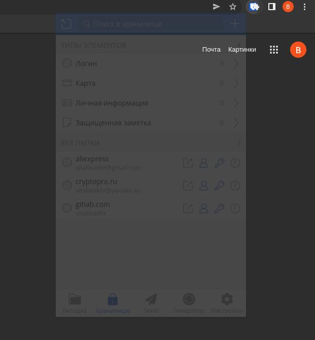
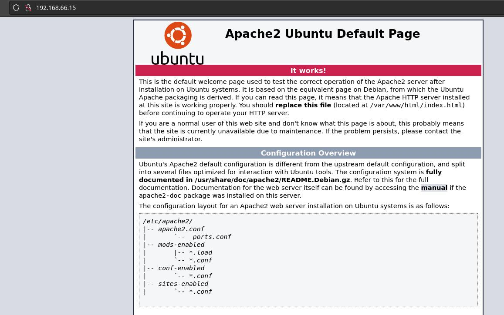
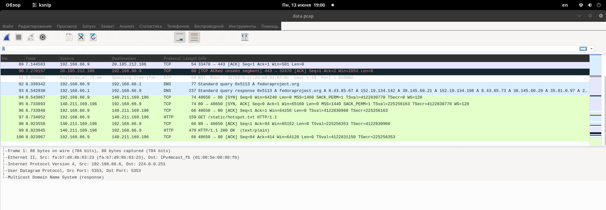

# Домашнее задание к занятию "3.9. Элементы безопасности информационных систем"
## 1. Установите Bitwarden плагин для браузера. Зарегестрируйтесь и сохраните несколько паролей.
Ответ:
Сделал. 

***
##2. Установите Google authenticator на мобильный телефон. Настройте вход в Bitwarden акаунт через Google authenticator OTP.
Ответ:
Установил
***
##3. Установите apache2, сгенерируйте самоподписанный сертификат, настройте тестовый сайт для работы по HTTPS.
Ответ:
```
vagrant@ubuntu-2004-vagrant:~$ sudo apt install apache2
vagrant@ubuntu-2004-vagrant:~$ sudo a2enmod ssl
vagrant@ubuntu-2004-vagrant:~$ sudo systemctl restart apache2
vagrant@ubuntu-2004-vagrant:~$ sudo openssl req -x509 -nodes -days 365 -newkey rsa:2048 -keyout /etc/ssl/private/apache-selfsigned.key -out /etc/ssl/certs/apache-selfsigned.crt
Generating a RSA private key
...........................+++++
............................................+++++
writing new private key to '/etc/ssl/private/apache-selfsigned.key'

You are about to be asked to enter information that will be incorporated
into your certificate request.
What you are about to enter is what is called a Distinguished Name or a DN.
There are quite a few fields but you can leave some blank
For some fields there will be a default value,
If you enter '.', the field will be left blank.

Country Name (2 letter code) [AU]:RU
State or Province Name (full name) [Some-State]:Kaliningradskaya obl
Locality Name (eg, city) []:Kaliningrad
Organization Name (eg, company) [Internet Widgits Pty Ltd]:Example
Organizational Unit Name (eg, section) []:Example
Common Name (e.g. server FQDN or YOUR name) []:development39.local
Email Address []:mailv@development39.ru

vagrant@ubuntu-2004-vagrant:/etc/apache2/sites-available$ sudo nano /etc/apache2/sites-available/192.168.66.4.conf

<VirtualHost *:443>
   ServerName 192.168.66.4
   DocumentRoot /var/www/192.168.66.4

   SSLEngine on
   SSLCertificateFile /etc/ssl/certs/apache-selfsigned.crt
   SSLCertificateKeyFile /etc/ssl/private/apache-selfsigned.key
</VirtualHost>

vagrant@ubuntu-2004-vagrant:/etc/apache2/sites-available$ sudo mkdir /var/www/192.168.66.4
vagrant@ubuntu-2004-vagrant:/etc/apache2/sites-available$ sudo nano /var/www/192.168.66.4/index.html
<h1>it worked!  Netology</h1>
vagrant@ubuntu-2004-vagrant:/etc/apache2/sites-available$ sudo a2ensite 192.168.66.4.conf
Enabling site 192.168.66.4.
To activate the new configuration, you need to run:
  systemctl reload apache2
vagrant@ubuntu-2004-vagrant:/etc/apache2/sites-available$ sudo apache2ctl configtest
AH00558: apache2: Could not reliably determine the server's fully qualified domain name, using 127.0.2.1. Set the 'ServerName' directive globally to suppress this message
Syntax OK
```

Скрины с разным IP  так делались в разное время

***
## 4. Проверьте на TLS уязвимости произвольный сайт в интернете (кроме сайтов МВД, ФСБ, МинОбр, НацБанк, РосКосмос, РосАтом, РосНАНО и любых госкомпаний, объектов КИИ, ВПК ... и тому подобное).
Ответ:
```
[vitalii@fedora ~]$   mkdir TLS
[vitalii@fedora ~]$ cd TLS
[vitalii@fedora TLS]$ git clone --depth 1 https://github.com/drwetter/testssl.sh.git
Клонирование в «testssl.sh»…
remote: Enumerating objects: 103, done.
remote: Counting objects: 100% (103/103), done.
remote: Compressing objects: 100% (93/93), done.
remote: Total 103 (delta 15), reused 33 (delta 9), pack-reused 0
Получение объектов: 100% (103/103), 8.55 МиБ | 4.15 МиБ/с, готово.
Определение изменений: 100% (15/15), готово.
[vitalii@fedora TLS]$ cd testssl.sh

[vitalii@fedora testssl.sh]$ ./testssl.sh -U --sneaky https://mail.spar39.ru/

###########################################################
    testssl.sh       3.1dev from https://testssl.sh/dev/
    (13298ff 2022-06-01 09:47:12)

      This program is free software. Distribution and
             modification under GPLv2 permitted.
      USAGE w/o ANY WARRANTY. USE IT AT YOUR OWN RISK!

       Please file bugs @ https://testssl.sh/bugs/

###########################################################

 Using "OpenSSL 1.0.2-chacha (1.0.2k-dev)" [~179 ciphers]
 on fedora:./bin/openssl.Linux.x86_64
 (built: "Jan 18 17:12:17 2019", platform: "linux-x86_64")


 Start 2022-06-13 17:38:42        -->> 92.246.149.82:443 (mail.spar39.ru) <<--

 rDNS (92.246.149.82):   mail.spar39.ru.
 Service detected:       HTTP


 Testing vulnerabilities

 Heartbleed (CVE-2014-0160)                not vulnerable (OK), no heartbeat extension
 CCS (CVE-2014-0224)                       not vulnerable (OK)
 Ticketbleed (CVE-2016-9244), experiment.  not vulnerable (OK)
 ROBOT                                     Server does not support any cipher suites that use RSA key transport
 Secure Renegotiation (RFC 5746)           supported (OK)
 Secure Client-Initiated Renegotiation     not vulnerable (OK)
 CRIME, TLS (CVE-2012-4929)                not vulnerable (OK)
 BREACH (CVE-2013-3587)                    no gzip/deflate/compress/br HTTP compression (OK)  - only supplied "/" tested
 POODLE, SSL (CVE-2014-3566)               not vulnerable (OK)
 TLS_FALLBACK_SCSV (RFC 7507)              No fallback possible (OK), no protocol below TLS 1.2 offered
 SWEET32 (CVE-2016-2183, CVE-2016-6329)    not vulnerable (OK)
 FREAK (CVE-2015-0204)                     not vulnerable (OK)
 DROWN (CVE-2016-0800, CVE-2016-0703)      not vulnerable on this host and port (OK)
                                           make sure you don't use this certificate elsewhere with SSLv2 enabled services, see
                                           https://search.censys.io/search?resource=hosts&virtual_hosts=INCLUDE&q=C3B0444385990EEC11F60F76CE30A2974BD8EAA9AF67465D87F75543DDA79F89
 LOGJAM (CVE-2015-4000), experimental      not vulnerable (OK): no DH EXPORT ciphers, no common prime detected
 BEAST (CVE-2011-3389)                     not vulnerable (OK), no SSL3 or TLS1
 Winshock (CVE-2014-6321), experimental    not vulnerable (OK)
 RC4 (CVE-2013-2566, CVE-2015-2808)        no RC4 ciphers detected (OK)
 ```
 ***
## 5. Установите на Ubuntu ssh сервер, сгенерируйте новый приватный ключ. Скопируйте свой публичный ключ на другой сервер. Подключитесь к серверу по SSH-ключу.
Ответ:
```
enerating public/private rsa key pair.
Enter file in which to save the key (/home/vitalii/.ssh/id_rsa):
/home/vitalii/.ssh/id_rsa already exists.
Overwrite (y/n)? y
Enter passphrase (empty for no passphrase):
Enter same passphrase again:
Your identification has been saved in /home/vitalii/.ssh/id_rsa
Your public key has been saved in /home/vitalii/.ssh/id_rsa.pub
The key fingerprint is:
SHA256:71s+uWZa4RjjKCn32IIhrb13TVFp+ca6ItAc/7vt4So vitalii@fedora
The key's randomart image is:
+---[RSA 3072]----+
|             o   |
|            =    |
|           o o   |
|        . .   +  |
|   .   oSoo..o   |
|  . o ..o+o=..   |
|   +.o+..o+.+o.  |
|  . ooo=o.E+Bo . |
|    .o.oo.+B*B+  |
+----[SHA256]-----+


[vitalii@fedora ~]$ ssh-copy-id vvakhromeev@192.168.0.84
The authenticity of host '192.168.0.84 (192.168.0.84)' can't be established.
ED25519 key fingerprint is SHA256:1lc97faW6CemSW8VCeJVz6xebZTa12zzfWkRC7XGT74.
This key is not known by any other names
Are you sure you want to continue connecting (yes/no/[fingerprint])? yes
/usr/bin/ssh-copy-id: INFO: attempting to log in with the new key(s), to filter out any that are already installed
/usr/bin/ssh-copy-id: INFO: 1 key(s) remain to be installed -- if you are prompted now it is to install the new keys
vvakhromeev@192.168.0.84's password:

Number of key(s) added: 1

Now try logging into the machine, with:   "ssh 'vvakhromeev@192.168.0.84'"
and check to make sure that only the key(s) you wanted were added.

[vitalii@fedora ~]$ ssh vvakhromeev@192.168.0.84
Last login: Fri Jun 10 18:56:54 2022

[vitalii@fedora ~]$ cp /home/vitalii/.ssh/id_rsa ~/test.key
[vitalii@fedora ~]$ ssh -i ~/test.key vvakhromeev@192.168.0.84
Last login: Mon Jun 13 18:15:37 2022 from 10.237.1.32
```
***
## 6.Переименуйте файлы ключей из задания 5. Настройте файл конфигурации SSH клиента, так чтобы вход на удаленный сервер осуществлялся по имени сервера.
Ответ:
```
[vitalii@fedora ~]$ touch ~/.ssh/config
[vitalii@fedora ~]$ nano ~/.ssh/config

Host work
 HostName 192.168.0.84
 IdentityFile ~/test.key
 User vvakhromeev
 #Port 2222
 #StrictHostKeyChecking no

[vitalii@fedora ~]$ chmod 600 ~/.ssh/config
[vitalii@fedora ~]$ ssh work
Last login: Mon Jun 13 18:24:35 2022 from 10.237.1.32

[vvakhromeev@fedora ~]$

***
## 7. Соберите дамп трафика утилитой tcpdump в формате pcap, 100 пакетов. Откройте файл pcap в Wireshark.
Ответ:
[vitalii@fedora ~]$ sudo tcpdump -n -c 100 -w data.pcap
dropped privs to tcpdump
tcpdump: listening on enp35s0, link-type EN10MB (Ethernet), snapshot length 262144 bytes
100 packets captured
116 packets received by filter
0 packets dropped by kernel
```
Открыл в Wireshark. 


***
# Задание для самостоятельной отработки (необязательно к выполнению)

## 8*. Просканируйте хост scanme.nmap.org. Какие сервисы запущены?
Ответ:
```
[vitalii@fedora ~]$ sudo nmap -sV scanme.nmap.org
Starting Nmap 7.92 ( https://nmap.org ) at 2022-06-13 19:14 EET
Nmap scan report for scanme.nmap.org (45.33.32.156)
Host is up (0.22s latency).
Other addresses for scanme.nmap.org (not scanned): 2600:3c01::f03c:91ff:fe18:bb2f
Not shown: 995 closed tcp ports (reset)
PORT      STATE    SERVICE    VERSION
22/tcp    open     ssh        OpenSSH 6.6.1p1 Ubuntu 2ubuntu2.13 (Ubuntu Linux; protocol 2.0)
80/tcp    open     http       Apache httpd 2.4.7 ((Ubuntu))
2323/tcp  filtered 3d-nfsd
9929/tcp  open     nping-echo Nping echo
31337/tcp open     tcpwrapped
Service Info: OS: Linux; CPE: cpe:/o:linux:linux_kernel

Service detection performed. Please report any incorrect results at https://nmap.org/submit/ .
Nmap done: 1 IP address (1 host up) scanned in 19.06 seconds
```